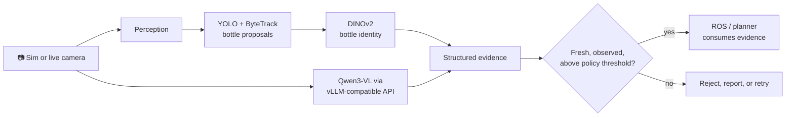

# 🍸 Vision for the Robot Bartender

> **Perception, evaluation, and simulation tooling for a safer autonomous bartender.**

This repository is the perception side of the bartender project: it turns camera frames into structured evidence about bottles, glasses, and the workspace, then evaluates that evidence before a robot is allowed to use it. It deliberately stays separate from ROS motion control—the model can observe and advise; robot-control software remains responsible for safety and actuation.

<p align="center">
  
  
  
  
</p>

## What lives here



| Area | What it provides | Start here |
|---|---|---|
| **VLM evaluation** | Qwen3-VL prompts, real-photo and simulated-scene evaluation, an iterative prompt harness, and JSONL data tooling. | [`training/`](training) |
| **Bottle vision** | Live RGB detection, tracking, data collection, DINOv2 classification, and an HTTP/MJPEG serving adapter. | [`README_BOTTLE_VISION.md`](README_BOTTLE_VISION.md) |
| **Cup tracking** | A live DINOv2 tracker that serves the orange cup's image-space centre for pour planning. | [`training/CUP_TRACKER.md`](training/CUP_TRACKER.md) |
| **Robot twin** | A two-armed Gazebo bartender and one-arm UR5e workcell, including ROS 2 actions, MoveIt, teach tooling, and models. | [`bartender_robot_sim/`](bartender_robot_sim) |
| **Contracts** | The versioned schema for scene-observation responses. | [`contracts/scene-v1.schema.json`](contracts/scene-v1.schema.json) |

## Quick start

### 1. Set up the vision tools

Use a Python 3.10+ environment. The bottle-vision requirements cover the live detector, classifier, and dataset scripts.

```powershell
python -m venv .venv
.\.venv\Scripts\Activate.ps1
pip install -r requirements-bottle-vision.txt
```

On Linux/macOS, activate with `source .venv/bin/activate`. GPU-backed PyTorch is strongly recommended for DINOv2 and VLM work; install the wheel appropriate for the machine before running GPU workloads.

### 2. Run a smoke test

```powershell
python -m pytest training
```

### 3. Try the two main perception paths

**Live bottle classification** — with a trained checkpoint and a webcam, MJPEG, RTSP stream, or video source:

```powershell
python -m training.live_bottle_infer checkpoints/bottles/best.pt --source 0
```

**VLM scene inspection** — point the client at an OpenAI-compatible vLLM endpoint:

```powershell
python -m training.stream_vlm `
  --source 0 `
  --endpoint http://localhost:8101 `
  --model sft-r1 `
  --show
```

`stream_vlm.py` sends the newest available frame rather than working through a stale camera buffer, prints request latency, and can overlay valid responses. Press `q` to quit the preview.

## VLM workflow

The repository does **not** serve a foundation model itself. Instead, its clients and evaluation tools target an OpenAI-compatible endpoint—normally Qwen3-VL hosted through vLLM on a GPU machine.

```bash
# On the GPU host; choose your trained checkpoint and model name.
vllm serve <checkpoint> --served-model-name sft-r1 --port 8101
```

```powershell
# From another machine, optionally tunnel the private endpoint.
ssh -L 8101:localhost:8101 user@<gpu-host>

# Evaluate a photo collection and preserve every response for review.
python -m training.eval_bottles photos --strict-contract --out bottles_eval.jsonl
```

The strict evaluation prompt constrains inventory names and rejects known distractors instead of guessing. See [`training/eval_bottles.py`](training/eval_bottles.py) for options such as `--limit`, `--max-pixels`, and `--prompt-file`.

For systematic prompt iteration against generated workcell scenes, use the harness:

```powershell
python -m training.harness run `
  --dev data/workcell_raw/dev `
  --test data/workcell_raw/test `
  --pool data/workcell_raw/pool `
  --endpoint http://127.0.0.1:8101

python -m training.harness serve --out outputs/harness
```

The harness selects only on the development set, reports the untouched test set, stores experiments in SQLite, and produces a small local results site.

## Bottle-vision workflow

The RGB pipeline is designed for quick, stable identity recognition in the overhead camera:

```text
camera frame → YOLO bottle detections → ByteTrack IDs → DINOv2 classifier
                                              ↓
                                  temporal averaging / UNKNOWN gate
```

Collect labelled crops, make leakage-resistant session splits, then train and run the classifier:

```powershell
python -m training.live_bottle_label --source http://camera-host:8767/stream
python -m training.prepare_bottle_dataset data/bottles/metadata.jsonl
python -m training.train_bottle_classifier --data data/bottles/split --stage head
python -m training.train_bottle_classifier --data data/bottles/split --stage finetune --epochs 6
python -m training.live_bottle_infer checkpoints/bottles/best.pt --source http://camera-host:8767/stream
```

The data-preparation stage keeps each capture session in exactly one split. The live stage smooths predictions per tracker ID and exposes `UNKNOWN` when confidence does not clear its threshold. Full collection, training, and deployment notes are in [`README_BOTTLE_VISION.md`](README_BOTTLE_VISION.md).

## Simulation and robot integration

[`bartender_robot_sim/`](bartender_robot_sim) is a self-contained ROS 2 Humble/Gazebo workspace for validating perception against a two-armed bar and a one-arm physical-workcell twin. It owns motion, MoveIt planning, controllers, and robot safety boundaries.

On a ROS 2 Humble machine, its normal first-run path is:

```bash
cd bartender_robot_sim/ros2_ws
source /opt/ros/humble/setup.bash
colcon build --symlink-install
source install/setup.bash
ros2 launch bartender_bringup bartender_sim.launch.py
```

The simulation is substantial and has its own setup, hardware, Docker, and operating guidance. Read the [robot simulator README](bartender_robot_sim/README.md), then [its architecture guide](bartender_robot_sim/docs/ARCHITECTURE.md), before moving a model integration toward a robot.

## Interface contract and safety boundary

[`scene-v1.schema.json`](contracts/scene-v1.schema.json) specifies a versioned **scene-observation response**: request/camera identity, observation status, model provenance, visible objects, normalized bounding boxes, and obstruction evidence.

```json
{
  "schema_version": "v1",
  "request_id": "scene-42",
  "camera": {"id": "stand", "captured_at": "2026-09-26T12:00:00Z"},
  "observation": {"status": "observed"},
  "model": {"name": "sft-r1", "version": "checkpoint-id"},
  "objects": [{"name": "whiskey", "visible": true, "confidence": 0.94, "bbox": [120, 200, 280, 850]}],
  "obstruction": false
}
```

Important integration rule: a perception result is evidence, never a motion command. The caller must require an `observed` status, reject stale captures, and enforce confidence and task-specific safety policies before translating evidence into a ROS request. Keep model name and version in logs and recorded episodes.

## Repository map

```text
.
├── bottle_vision/          reusable detector, tracker, classifier, and HTTP/MJPEG adapter
├── calibration/            camera/table calibration artefacts
├── contracts/              versioned interchange schemas
├── data/                   local captures and generated datasets
├── photos/                 reference and evaluation imagery
├── training/               VLM, classifier, calibration, and evaluation CLIs + tests
├── bartender_robot_sim/    ROS 2 / Gazebo simulation and workcell twin
├── README_BOTTLE_VISION.md detailed bottle-vision operating guide
└── requirements-bottle-vision.txt
```

## Useful commands

| Goal | Command |
|---|---|
| Run training-tool tests | `python -m pytest training` |
| Inspect a VLM on a live feed | `python -m training.stream_vlm --source 0 --show` |
| Evaluate a photo directory | `python -m training.eval_bottles photos --strict-contract` |
| Label bottle crops | `python -m training.live_bottle_label --source <stream>` |
| Run bottle inference | `python -m training.live_bottle_infer <checkpoint> --source <stream>` |
| Track the cup | `python -m training.cup_center_live --help` |
| Launch the simulated bar | `ros2 launch bartender_bringup bartender_sim.launch.py` |

## Contributing

Keep perception and robot control decoupled; add tests alongside training tools; and avoid treating a high-confidence model output as proof that a physical action is safe. For ROS/Gazebo code, follow the [simulator contribution guide](bartender_robot_sim/docs/CONTRIBUTING.md).

---

Built for careful experimentation at the boundary between visual understanding and physical action.
